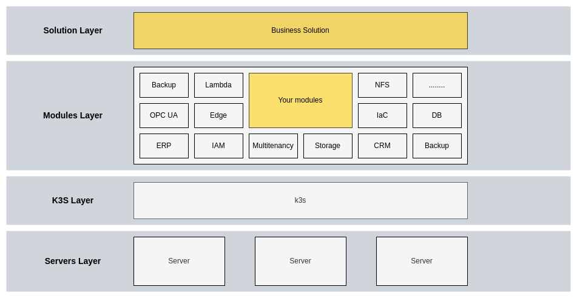

# ⚠️⚠️⚠️ In development ⚠️⚠️⚠️

Plans:

- ***February 2023*** - first stable version running on production. 
- ***March 2023 - April 2023*** - working in production under higher workloads. Up to 1gbps ingress.

# OpenBP - Open Business platform

## Capabilities
Here's what OpenBP offers out of the box for developers, implementation companies and businesses:

### Developers
- Created by developers for developers. We want this to be as easy and beautifulll as possible. 
- **Developer-friendly version-controlled** environment (with [GIT](https://git-scm.com/)) to create custom configurations.
- **CI/CD** pipelines for easy deployments and support
- **OpenTelemetry** tracing to debug
- Intense set of highly detailed **documentation**
- gRPC interservice communication. Use whatever language you want :)
- There are no limit in what you can create. Just create one more microservice and OpenBP will handle everything.
- Use of state-of-the-art technologies and practices: [MongoDB](https://www.mongodb.com/), [RedisDB](https://redis.io/) cahing, [RabbitMQ](https://www.rabbitmq.com/) messaging and task manager, [Docker](https://www.docker.com/), [k3s](https://k3s.io/), [OpenAPI3.0](https://swagger.io/specification/), [gRPC](https://grpc.io/) ....

### Implementation companies
- **SaaS-enabled** by default. One place for all customers
- **Multitenant and multi namespace** system capable to manage multiple clients with non-standard/modified configurations.
- Dynamic workflow managing, resource sharing, and workload redistribution. All customers are using same resources and are working on the same cluster. Very efficient and easy to maintain.
- Advanced **SaaS** tools for managing customers and their deployments.
- **Traceability** dashboards with current system status, logs, events, and errors.
- Automatic billing based on resource usage

### Business
- Open-source and free
- Unlimited **scalability** by default. Dont think about the scale of your business and ammount of data. This system will handle everything.
- Hight-availability option to ensure **99.9% uptime**.
- **On-the-fly updates** will not stop your critical workflows.
- Industrial grade security environment complied with **ISO/IEC 27001** requirements.
- **GDPR** complied storage system and data flow.
- Highly flexible and extendable.
- Integrated with edge computing and device management.
- Includes big set of solutions: ERP, CRM, Edge computing, etc.

That's not all ;). Please, check [Architectural vision](./docs/architecture/architecture_vision.md) if you want to know more.

## Partners

  
  

## License
OpenBP is free and open source. It is distributed under AGPL3 license. If you need an Enterprise license - contact us.